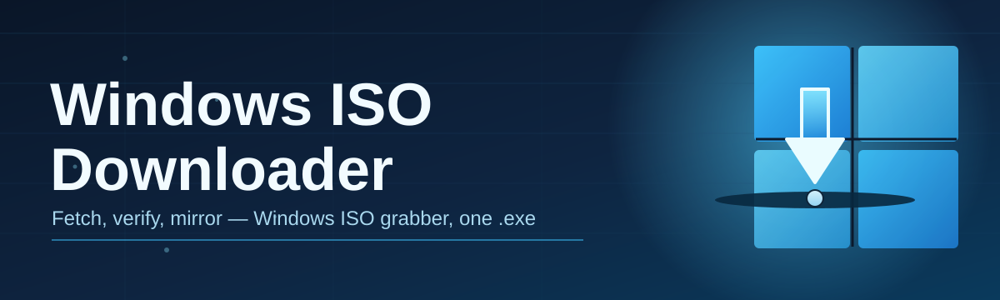

# windows-iso-download-manager 💽🪟

  

*Fetch official Windows disk images without digging through a maze of mirrors and pop-up ads.*

  

## 🧭 Overview

`windows-iso-download-manager` is a lightweight desktop companion for anyone who needs a clean, verifiable Windows ISO — sysadmins re-imaging a fleet of laptops, hobbyists spinning up a fresh virtual machine, or a technician sitting in front of a machine that just won't boot anymore. Instead of hunting across forums and sketchy redirect chains, you point the tool at a release channel, pick your edition and language, and let it manage the retrieval queue for you.

The project exists because sourcing a legitimate Windows image has quietly become harder every year. Official pages rotate endpoints, regional restrictions block direct links, and download managers built into browsers rarely resume properly after a dropped connection. This tool wraps that whole process — endpoint discovery, checksum verification, resumable transfers — into a single interface so you spend less time troubleshooting a download and more time actually doing the reinstall.

It's built for a wide range of comfort levels. If you've never built a bootable USB drive before, the guided flow explains each screen as you go. If you're a power user managing dozens of machines, the batch queue and scripting hooks let you fetch several editions back-to-back without babysitting the window. Either way, the target is the same: a predictable, transparent Windows ISO download experience.

<blockquote>

**Community note:** this project is maintained by volunteers in their spare time. Good-first-issue labels are refreshed regularly — see the Contributing section below if you'd like to get involved.

</blockquote>

---

## ⚡ What It Actually Does

The tool is more than a link-clicker. Each capability below tackles a specific pain point people run into when trying to download a Windows ISO the "normal" way.

- **Edition and language matrix** — browse every supported Windows release side-by-side with its available languages and architectures (x64, ARM64, and 32-bit where offered) in one scrollable table instead of a chain of drop-down menus.

- **Resumable transfers** — lost your Wi-Fi mid-download of a 6 GB image? The manager picks the transfer back up from the last confirmed byte rather than restarting from zero.

- **Checksum verification built-in** — every completed download is hashed automatically and compared against the published reference value, so you know the file wasn't corrupted or tampered with in transit.

- **Batch queueing** — line up multiple editions (say, Home and Pro, or two language packs) and let them download sequentially without re-opening the app.

- **Bandwidth throttling** — cap transfer speed so a large ISO download doesn't choke a shared office connection during business hours.

- **Mirror rotation** — if one endpoint stalls or times out, the app automatically retries against an alternate source rather than leaving you staring at a frozen progress bar.

- **Portable mode** — run it straight from a USB stick with zero installer footprint on the host machine, handy for field technicians.

- **Dark and light theming** — because staring at a stark white progress window at 2 AM during an emergency reimage is nobody's idea of fun.

> [!TIP]
> Pair the batch queue with bandwidth throttling if you're preparing several machines overnight — set a cap, queue everything, and check back in the morning.

---

## 🚀 Getting Started, Step by Step

You don't need to compile anything or install a dependency chain. Here's the whole path from zero to a bootable ISO:

1. **Visit the landing page.** Click the download button anywhere on this page — it takes you to the official project site with the current build.

2. **Download the standalone executable.** There's nothing else to fetch; the app ships as a single self-contained binary for Windows.

3. **Launch it.** Double-click the executable. No setup wizard, no background services installed — it opens straight into the edition picker.

4. **Pick your release, queue it, and verify.** Choose the Windows edition, language, and architecture you need, start the download, and let the built-in checksum check confirm the file is clean before you burn it to USB or mount it in a VM.

> [!NOTE]
> Running the executable for the first time may trigger a SmartScreen prompt because the binary is new to Microsoft's reputation database, not because anything is wrong with it. Click "More info" → "Run anyway" if you trust the source you downloaded it from.

---

## 🖥️ System Requirements

| Requirement | Detail |
|---|---|
| Operating system | Windows 10 (64-bit) or Windows 11 |
| Disk space | At least 8 GB free for the largest editions |
| Dependencies | None — fully standalone, no runtime to install |
| Permissions | Standard user account is enough; admin rights not required |
| Network | Broadband connection recommended for multi-gigabyte transfers |

  

---

## 🔧 How It Works

Under the hood, the download manager follows a straightforward pipeline every time you request an image:

1. It queries the current release catalog to find valid endpoints for the edition, language, and architecture you selected.
2. It opens a segmented, resumable connection to the chosen source.
3. Data streams into a temporary file while a live progress readout tracks speed and ETA.
4. Once the transfer completes, the file is hashed and compared against the known-good checksum.
5. The verified ISO is moved into your chosen output folder, ready to mount or flash.

> [!IMPORTANT]
> If checksum verification fails, do not use the file. Delete it and re-download rather than proceeding — a mismatched hash usually means a corrupted or incomplete transfer.

---

## 🧩 Troubleshooting

<strong>The download stalls at a fixed percentage and never moves.</strong>

 

This usually means the current mirror has gone unresponsive. Pause and resume the transfer — the app will attempt mirror rotation automatically on the next retry.

<strong>Windows SmartScreen is blocking the executable.</strong>

 

This is expected for newer builds without an established reputation history. Choose "More info" → "Run anyway" if you obtained the file from the official landing page linked in this README.

<strong>The checksum verification failed.</strong>

 

Delete the file and re-download it. A checksum mismatch means bytes were dropped or altered somewhere in transit — it does not mean your settings are wrong.

<strong>My antivirus flagged the ISO download manager itself.</strong>

 

Some heuristics flag any tool that performs large binary transfers and file hashing. If you're uneasy, verify the download page URL matches the one linked from this repository before whitelisting anything.

<strong>Can I use this to download older, unsupported Windows versions?</strong>

 

The catalog only lists editions that are still officially distributed. Discontinued releases without a supported distribution point won't appear in the picker.

<strong>The app opens but the edition list is empty.</strong>

 

Check your network connection — the catalog refresh requires reaching the release index on startup. A corporate proxy or firewall may need an allowance for outbound HTTPS traffic.

---

## 🎨 Interface, Shortcuts & Settings

The interface is intentionally minimal — a picker, a queue, and a progress pane — but there are a few conveniences worth knowing about:

- `Ctrl + N` opens a new download queue item

- `Ctrl + P` pauses or resumes the active transfer

- `Ctrl + Shift + V` re-runs checksum verification on a completed file

- `Ctrl + ,` opens Settings, where you can toggle dark/light theme, set the default output folder, and adjust the bandwidth cap

> [!TIP]
> Settings persist between sessions in portable mode too, as long as the executable stays in the same folder — the config file lives right beside it.

---

## 🤝 Contributing & Community

This project grows because people like you file issues, suggest editions to support, and submit small fixes. Whether you're touching your first pull request ever or your five-hundredth, you're welcome here.

- Look for issues tagged `good first issue` — they're scoped intentionally small and come with context in the description.

- Discussion threads are open for feature ideas before they become formal issues, so feel free to float a concept and see what the community thinks.

- Bug reports are most useful when they include your Windows build number and which edition/language combination you were downloading.

> [!NOTE]
> No contribution is too small — typo fixes in documentation are just as welcome as code changes.

---

## 📜 License

Released under the [MIT License](LICENSE), 2026. Use it, fork it, build on it — just keep the license notice intact.

---

## ⚠️ Disclaimer

This tool is an independent, community-maintained utility for locating and retrieving official Windows disk images. It is not affiliated with, endorsed by, or sponsored by Microsoft Corporation. All trademarks belong to their respective owners. You are responsible for ensuring you hold a valid license for any Windows edition you install using an ISO obtained through this tool.

> [!WARNING]
> Always verify checksums before deploying an ISO to production or client machines. The maintainers are not responsible for data loss resulting from a corrupted or improperly verified image.

